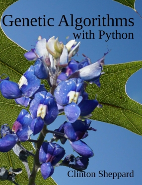

# Genetic Algorithms with Python
Source code from the book <i>Genetic Algorithms with Python</i> by [Clinton Sheppard](https://github.com/handcraftsman), rewritten in __C#__.

## Action Items
* Cleanup the main __README.md__
* Optimize the Tic-Tac-Toe algorithms
* Document the current benchmarks
* Create benchmarks for the following project
  * The Lawnmower Problem
  * Logic Circuits
  * Regular Expressions
  * Tic-tac-toe

## Author
:fire: [Greg Eakin](https://www.linkedin.com/in/gregeakin)